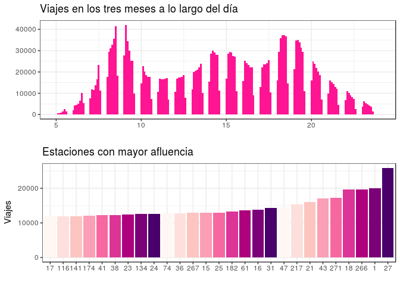
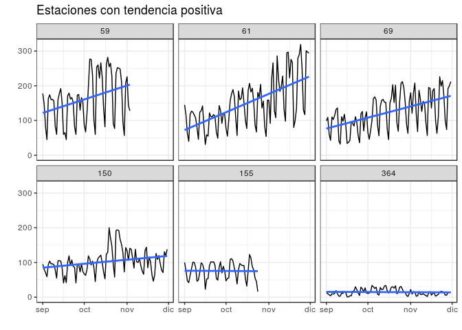
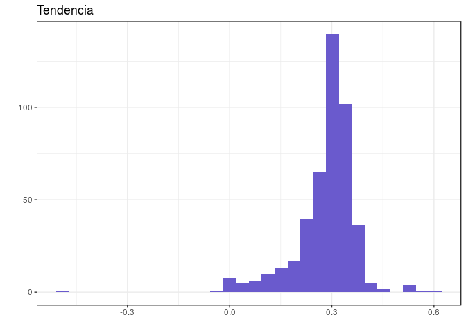
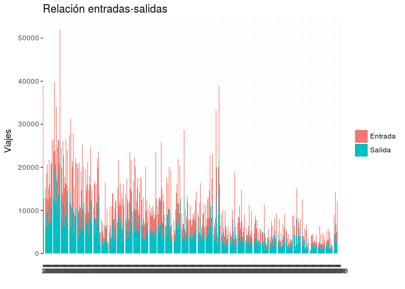
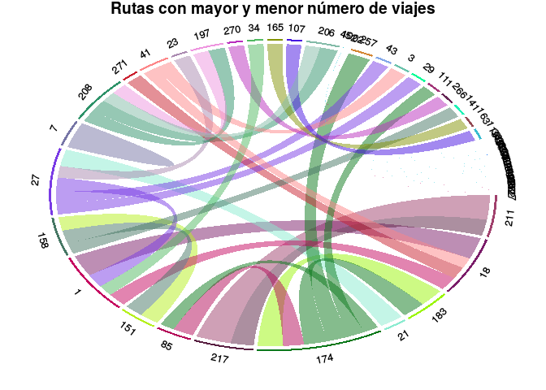
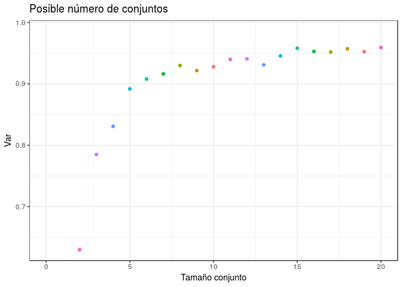
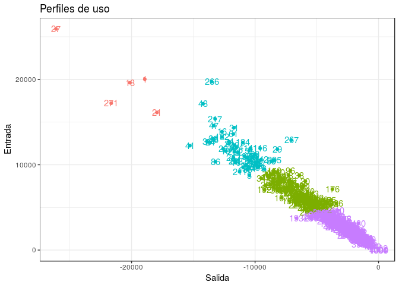
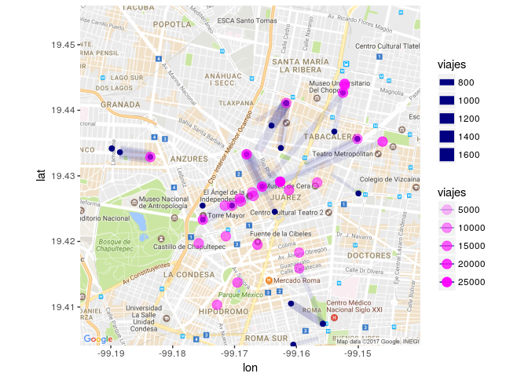

Bebés
-----

### Obtención y limpieza de los datos

El Marco Geoestadístico Nacional es un sistema único diseñado por el
INEGI, para referenciar correctamente la información estadística de los
censos y encuestas con los lugares geográficos correspondientes
[1](http://www.inegi.org.mx/geo/contenidos/geoestadistica/) . Divide al
territorio nacional en áreas con límites identificables en campo,
denominadas áreas geoestadísticas, con tres niveles de desagregación:
Estatal (AGEE), Municipal (AGEM) y Básica (AGEB), ésta puede ser urbana
o rural. A cada área geoestadística se le asigna una clave la cual se
construye con una serie ordenada de 9 dígitos
[2](http://geoweb.inegi.org.mx/mgn2kData/evidencias/PHC.pdf), los dos
primeros corresponden a la clave de la entidad federativa (AGEM, en el
caso de la CdMx ésta clave es 09), seguida de tres dígitos la clave de
municipio o delegación (AGEM, en el caso de la delegación Alvaro Obregon
es 010) y concluye con cuatro dígitos indicando la localidad.

En la direccion web <http://www3.inegi.org.mx/sistemas/ageburbana/> se
pueden realizar consultas referentes a las claves y del censo de
población y vivienda del 2010 en México asociado a las áreas
geoestadísticas. La consulta que se realiza para obtener los datos con
los que se trabaja consiste en seleccionar en el paso 1 ‘Distrito
Federal’, seleccionar en el paso 2 las siguientes variables cuya
descripción se encuentra en
[3](http://www3.inegi.org.mx/sistemas/ageburbana/doc/fd_Agebmza_urbana.pdf):

-   Clave de entidad federativa
-   Nombre de la entidad
-   Clave de municipio o delegación
-   Nombre del municipio o delegación
-   Clave de localidad
-   Nombre de la localidad
-   Clave de la manzana
-   Población de 0 a 2 años <!-- *Población femenina --->
    <!-- ( Población femenina de 12 años y más) -->
    <!-- ( Promedio de hijos nacidos vivos) -->

Después oprimir el botón ‘’Definir filtro’, en el paso 3 seleccionar la
variable ‘Clave de entidad federativa’ luego en el cuadro de texto del
paso 4 escribir la clave ‘010’ y oprimir el boton ‘agregar’ seguido del
botón ‘consultar’. Para exportar los datos consultados (que reportan
información a nivel manzana por localidad) oprimimos en la sección de
opciones el botón ‘texto’. Los datos se encuentran en el archivo
'iter2010\_ageb.txt'

El sitio de donde se obtuvieron los datos indica que por cuestiones de
confidencialidad algunos valores de la variable ‘Población de 0 a 2
años’
<!-- ’Población femenina’, ‘Población femenina de 12 años y más’ y ‘Promedio de hijos nacidos vivos’ -->
no se reportan y en su lugar se presenta el valor '\*', a pesar de que
*no es una técnica ideal de imputación de datos*, en vista de que la
distribución de valores no reportados por confidencialidad es diferente
a lo largo de las AGEB, se omiten esos registros del conjunto de datos
inicial.

    library(circlize)
    library(lubridate)

    ## 
    ## Attaching package: 'lubridate'

    ## The following object is masked from 'package:base':
    ## 
    ##     date

    library(dplyr)

    ## 
    ## Attaching package: 'dplyr'

    ## The following objects are masked from 'package:lubridate':
    ## 
    ##     intersect, setdiff, union

    ## The following objects are masked from 'package:stats':
    ## 
    ##     filter, lag

    ## The following objects are masked from 'package:base':
    ## 
    ##     intersect, setdiff, setequal, union

    library(ggplot2)
    library(RColorBrewer)
    library(xtable)
    rawdata <- read.csv('iter2010_ageb.txt', na.strings = '*')
    data <- na.omit(rawdata)

### Estimación

A partir de las cifras por manzanas de las áreas geoestadisticas básicas
de la población entre 0 a 2 años de edad (variables *P*\_0*A*2 de la
delegación Álvaro Obregón, se puede estimar la población de los bebés de
0 a 6 meses de la siguiente manera: Agrupando y sumando *P*\_0*A*2 por
área básica. Suponiendo que la distribución de las personas en este
conjunto ( de 0 a 2 años en ese lugar) es uniforme, se divide la suma
anterior entre 4. Las estimaciones para cada AGEB se encuentran en el
cuadro 1.

La estimación anterior acota superiormente al número de bebés que viven
en la región debido la población en el rango de edad \[0,2\] descendió
en el país desde el 2000
[4](http://www.inegi.org.mx/est/contenidos/proyectos/graficas_temas/piramides/graf/2000.html)
al 2010
[5](http://www.inegi.org.mx/est/contenidos/proyectos/graficas_temas/piramides/graf/2010.html)
y a que en la CdMx la tasa de fecundidad también ha descendido desde el
2010 ( véase la pág. 19 de
[6](http://www.conapo.gob.mx/work/models/CONAPO/Proyecciones/Cuadernos/09_Cuadernillo_DistritoFederal.pdf)
)

    cleanData <- data %>% filter(AGEB != '0000') %>% filter(  MZA != 0) 
                #%>%mutate(Peques = PROM_HNV * P_12YMAS_F)
    Ageb <- cleanData %>% group_by(ENTIDAD, MUN,  AGEB ) %>% 
        summarise( P_0A2 = sum(P_0A2))
    a <- Ageb %>% mutate(p1 = (1/4)*P_0A2  )
    est <- data.frame(AGEB = paste0(paste0('0',a$ENTIDAD), paste0('0',a$MUN),
                                    a$AGEB ), Bebes = a$p1 )
    kable(est)

<table>
<thead>
<tr class="header">
<th align="left">AGEB</th>
<th align="right">Bebes</th>
</tr>
</thead>
<tbody>
<tr class="odd">
<td align="left">090100012</td>
<td align="right">8.75</td>
</tr>
<tr class="even">
<td align="left">090100027</td>
<td align="right">16.00</td>
</tr>
<tr class="odd">
<td align="left">090100031</td>
<td align="right">33.75</td>
</tr>
<tr class="even">
<td align="left">090100046</td>
<td align="right">59.50</td>
</tr>
<tr class="odd">
<td align="left">090100050</td>
<td align="right">35.00</td>
</tr>
<tr class="even">
<td align="left">090100065</td>
<td align="right">53.75</td>
</tr>
<tr class="odd">
<td align="left">090100084</td>
<td align="right">22.00</td>
</tr>
<tr class="even">
<td align="left">090100099</td>
<td align="right">42.50</td>
</tr>
<tr class="odd">
<td align="left">090100101</td>
<td align="right">3.00</td>
</tr>
<tr class="even">
<td align="left">090100116</td>
<td align="right">52.75</td>
</tr>
<tr class="odd">
<td align="left">090100135</td>
<td align="right">107.00</td>
</tr>
<tr class="even">
<td align="left">09010014A</td>
<td align="right">44.00</td>
</tr>
<tr class="odd">
<td align="left">090100169</td>
<td align="right">25.50</td>
</tr>
<tr class="even">
<td align="left">090100173</td>
<td align="right">43.25</td>
</tr>
<tr class="odd">
<td align="left">090100188</td>
<td align="right">4.25</td>
</tr>
<tr class="even">
<td align="left">090100192</td>
<td align="right">3.75</td>
</tr>
<tr class="odd">
<td align="left">090100205</td>
<td align="right">0.00</td>
</tr>
<tr class="even">
<td align="left">09010021A</td>
<td align="right">0.75</td>
</tr>
<tr class="odd">
<td align="left">090100224</td>
<td align="right">0.75</td>
</tr>
<tr class="even">
<td align="left">090100239</td>
<td align="right">4.75</td>
</tr>
<tr class="odd">
<td align="left">090100243</td>
<td align="right">84.75</td>
</tr>
<tr class="even">
<td align="left">090100258</td>
<td align="right">1.00</td>
</tr>
<tr class="odd">
<td align="left">090100262</td>
<td align="right">0.00</td>
</tr>
<tr class="even">
<td align="left">090100277</td>
<td align="right">2.50</td>
</tr>
<tr class="odd">
<td align="left">090100281</td>
<td align="right">2.50</td>
</tr>
<tr class="even">
<td align="left">090100296</td>
<td align="right">26.00</td>
</tr>
<tr class="odd">
<td align="left">090100309</td>
<td align="right">31.50</td>
</tr>
<tr class="even">
<td align="left">090100313</td>
<td align="right">70.75</td>
</tr>
<tr class="odd">
<td align="left">090100328</td>
<td align="right">84.50</td>
</tr>
<tr class="even">
<td align="left">090100332</td>
<td align="right">47.50</td>
</tr>
<tr class="odd">
<td align="left">090100347</td>
<td align="right">38.25</td>
</tr>
<tr class="even">
<td align="left">090100351</td>
<td align="right">49.00</td>
</tr>
<tr class="odd">
<td align="left">090100370</td>
<td align="right">37.75</td>
</tr>
<tr class="even">
<td align="left">090100385</td>
<td align="right">35.25</td>
</tr>
<tr class="odd">
<td align="left">090100417</td>
<td align="right">4.00</td>
</tr>
<tr class="even">
<td align="left">090100421</td>
<td align="right">65.75</td>
</tr>
<tr class="odd">
<td align="left">090100440</td>
<td align="right">67.50</td>
</tr>
<tr class="even">
<td align="left">090100455</td>
<td align="right">27.25</td>
</tr>
<tr class="odd">
<td align="left">090100474</td>
<td align="right">114.25</td>
</tr>
<tr class="even">
<td align="left">090100489</td>
<td align="right">48.75</td>
</tr>
<tr class="odd">
<td align="left">090100493</td>
<td align="right">36.75</td>
</tr>
<tr class="even">
<td align="left">090100506</td>
<td align="right">40.50</td>
</tr>
<tr class="odd">
<td align="left">090100510</td>
<td align="right">20.50</td>
</tr>
<tr class="even">
<td align="left">090100525</td>
<td align="right">12.25</td>
</tr>
<tr class="odd">
<td align="left">09010053A</td>
<td align="right">46.50</td>
</tr>
<tr class="even">
<td align="left">090100544</td>
<td align="right">19.75</td>
</tr>
<tr class="odd">
<td align="left">090100559</td>
<td align="right">16.50</td>
</tr>
<tr class="even">
<td align="left">090100563</td>
<td align="right">102.50</td>
</tr>
<tr class="odd">
<td align="left">090100578</td>
<td align="right">65.25</td>
</tr>
<tr class="even">
<td align="left">090100597</td>
<td align="right">35.25</td>
</tr>
<tr class="odd">
<td align="left">09010060A</td>
<td align="right">24.25</td>
</tr>
<tr class="even">
<td align="left">090100614</td>
<td align="right">11.25</td>
</tr>
<tr class="odd">
<td align="left">090100629</td>
<td align="right">12.50</td>
</tr>
<tr class="even">
<td align="left">090100633</td>
<td align="right">13.00</td>
</tr>
<tr class="odd">
<td align="left">090100648</td>
<td align="right">7.75</td>
</tr>
<tr class="even">
<td align="left">090100667</td>
<td align="right">48.00</td>
</tr>
<tr class="odd">
<td align="left">090100671</td>
<td align="right">15.75</td>
</tr>
<tr class="even">
<td align="left">090100686</td>
<td align="right">9.50</td>
</tr>
<tr class="odd">
<td align="left">090100690</td>
<td align="right">22.75</td>
</tr>
<tr class="even">
<td align="left">090100703</td>
<td align="right">11.75</td>
</tr>
<tr class="odd">
<td align="left">090100718</td>
<td align="right">4.50</td>
</tr>
<tr class="even">
<td align="left">090100722</td>
<td align="right">15.50</td>
</tr>
<tr class="odd">
<td align="left">090100737</td>
<td align="right">0.00</td>
</tr>
<tr class="even">
<td align="left">090100741</td>
<td align="right">24.00</td>
</tr>
<tr class="odd">
<td align="left">090100756</td>
<td align="right">13.25</td>
</tr>
<tr class="even">
<td align="left">090100760</td>
<td align="right">5.00</td>
</tr>
<tr class="odd">
<td align="left">090100775</td>
<td align="right">6.25</td>
</tr>
<tr class="even">
<td align="left">09010078A</td>
<td align="right">4.25</td>
</tr>
<tr class="odd">
<td align="left">090100794</td>
<td align="right">1.75</td>
</tr>
<tr class="even">
<td align="left">090100807</td>
<td align="right">11.25</td>
</tr>
<tr class="odd">
<td align="left">090100811</td>
<td align="right">5.25</td>
</tr>
<tr class="even">
<td align="left">090100826</td>
<td align="right">4.75</td>
</tr>
<tr class="odd">
<td align="left">090100830</td>
<td align="right">2.75</td>
</tr>
<tr class="even">
<td align="left">090100845</td>
<td align="right">8.25</td>
</tr>
<tr class="odd">
<td align="left">090100864</td>
<td align="right">61.00</td>
</tr>
<tr class="even">
<td align="left">090100898</td>
<td align="right">19.25</td>
</tr>
<tr class="odd">
<td align="left">090100900</td>
<td align="right">23.50</td>
</tr>
<tr class="even">
<td align="left">090100915</td>
<td align="right">12.50</td>
</tr>
<tr class="odd">
<td align="left">09010092A</td>
<td align="right">11.00</td>
</tr>
<tr class="even">
<td align="left">090100949</td>
<td align="right">2.25</td>
</tr>
<tr class="odd">
<td align="left">090100953</td>
<td align="right">7.50</td>
</tr>
<tr class="even">
<td align="left">090100968</td>
<td align="right">17.50</td>
</tr>
<tr class="odd">
<td align="left">090100972</td>
<td align="right">15.75</td>
</tr>
<tr class="even">
<td align="left">090100987</td>
<td align="right">5.25</td>
</tr>
<tr class="odd">
<td align="left">090100991</td>
<td align="right">7.25</td>
</tr>
<tr class="even">
<td align="left">090101006</td>
<td align="right">9.75</td>
</tr>
<tr class="odd">
<td align="left">090101010</td>
<td align="right">13.25</td>
</tr>
<tr class="even">
<td align="left">090101025</td>
<td align="right">5.50</td>
</tr>
<tr class="odd">
<td align="left">09010103A</td>
<td align="right">15.25</td>
</tr>
<tr class="even">
<td align="left">090101044</td>
<td align="right">18.25</td>
</tr>
<tr class="odd">
<td align="left">090101059</td>
<td align="right">10.75</td>
</tr>
<tr class="even">
<td align="left">090101063</td>
<td align="right">10.25</td>
</tr>
<tr class="odd">
<td align="left">090101078</td>
<td align="right">53.25</td>
</tr>
<tr class="even">
<td align="left">09010110A</td>
<td align="right">18.00</td>
</tr>
<tr class="odd">
<td align="left">090101114</td>
<td align="right">4.25</td>
</tr>
<tr class="even">
<td align="left">090101129</td>
<td align="right">7.25</td>
</tr>
<tr class="odd">
<td align="left">090101133</td>
<td align="right">9.50</td>
</tr>
<tr class="even">
<td align="left">090101148</td>
<td align="right">24.50</td>
</tr>
<tr class="odd">
<td align="left">090101152</td>
<td align="right">6.50</td>
</tr>
<tr class="even">
<td align="left">090101171</td>
<td align="right">135.00</td>
</tr>
<tr class="odd">
<td align="left">090101186</td>
<td align="right">19.75</td>
</tr>
<tr class="even">
<td align="left">090101190</td>
<td align="right">12.50</td>
</tr>
<tr class="odd">
<td align="left">090101203</td>
<td align="right">1.00</td>
</tr>
<tr class="even">
<td align="left">090101218</td>
<td align="right">7.50</td>
</tr>
<tr class="odd">
<td align="left">090101222</td>
<td align="right">21.25</td>
</tr>
<tr class="even">
<td align="left">090101237</td>
<td align="right">27.00</td>
</tr>
<tr class="odd">
<td align="left">090101241</td>
<td align="right">24.50</td>
</tr>
<tr class="even">
<td align="left">090101260</td>
<td align="right">9.25</td>
</tr>
<tr class="odd">
<td align="left">090101275</td>
<td align="right">7.75</td>
</tr>
<tr class="even">
<td align="left">09010128A</td>
<td align="right">13.25</td>
</tr>
<tr class="odd">
<td align="left">090101294</td>
<td align="right">10.50</td>
</tr>
<tr class="even">
<td align="left">090101307</td>
<td align="right">8.25</td>
</tr>
<tr class="odd">
<td align="left">090101330</td>
<td align="right">78.50</td>
</tr>
<tr class="even">
<td align="left">090101345</td>
<td align="right">84.75</td>
</tr>
<tr class="odd">
<td align="left">09010135A</td>
<td align="right">72.50</td>
</tr>
<tr class="even">
<td align="left">090101364</td>
<td align="right">69.25</td>
</tr>
<tr class="odd">
<td align="left">090101379</td>
<td align="right">6.75</td>
</tr>
<tr class="even">
<td align="left">090101434</td>
<td align="right">53.75</td>
</tr>
<tr class="odd">
<td align="left">090101453</td>
<td align="right">63.25</td>
</tr>
<tr class="even">
<td align="left">090101468</td>
<td align="right">32.50</td>
</tr>
<tr class="odd">
<td align="left">090101472</td>
<td align="right">57.00</td>
</tr>
<tr class="even">
<td align="left">090101487</td>
<td align="right">53.25</td>
</tr>
<tr class="odd">
<td align="left">090101519</td>
<td align="right">46.25</td>
</tr>
<tr class="even">
<td align="left">090101523</td>
<td align="right">40.00</td>
</tr>
<tr class="odd">
<td align="left">090101542</td>
<td align="right">26.25</td>
</tr>
<tr class="even">
<td align="left">090101557</td>
<td align="right">70.75</td>
</tr>
<tr class="odd">
<td align="left">090101561</td>
<td align="right">34.50</td>
</tr>
<tr class="even">
<td align="left">090101580</td>
<td align="right">73.75</td>
</tr>
<tr class="odd">
<td align="left">090101595</td>
<td align="right">67.25</td>
</tr>
<tr class="even">
<td align="left">090101627</td>
<td align="right">68.00</td>
</tr>
<tr class="odd">
<td align="left">090101631</td>
<td align="right">66.75</td>
</tr>
<tr class="even">
<td align="left">090101646</td>
<td align="right">61.75</td>
</tr>
<tr class="odd">
<td align="left">090101650</td>
<td align="right">60.50</td>
</tr>
<tr class="even">
<td align="left">090101665</td>
<td align="right">31.25</td>
</tr>
<tr class="odd">
<td align="left">09010167A</td>
<td align="right">79.25</td>
</tr>
<tr class="even">
<td align="left">090101684</td>
<td align="right">50.00</td>
</tr>
<tr class="odd">
<td align="left">090101699</td>
<td align="right">71.00</td>
</tr>
<tr class="even">
<td align="left">090101716</td>
<td align="right">90.25</td>
</tr>
<tr class="odd">
<td align="left">090101720</td>
<td align="right">33.50</td>
</tr>
<tr class="even">
<td align="left">090101735</td>
<td align="right">104.00</td>
</tr>
<tr class="odd">
<td align="left">09010174A</td>
<td align="right">112.25</td>
</tr>
<tr class="even">
<td align="left">090101754</td>
<td align="right">38.50</td>
</tr>
<tr class="odd">
<td align="left">090101769</td>
<td align="right">89.50</td>
</tr>
<tr class="even">
<td align="left">090101773</td>
<td align="right">43.75</td>
</tr>
<tr class="odd">
<td align="left">090101788</td>
<td align="right">45.25</td>
</tr>
<tr class="even">
<td align="left">090101792</td>
<td align="right">34.00</td>
</tr>
<tr class="odd">
<td align="left">090101805</td>
<td align="right">41.75</td>
</tr>
<tr class="even">
<td align="left">09010181A</td>
<td align="right">60.75</td>
</tr>
<tr class="odd">
<td align="left">090101824</td>
<td align="right">54.75</td>
</tr>
<tr class="even">
<td align="left">090101839</td>
<td align="right">57.75</td>
</tr>
<tr class="odd">
<td align="left">090101843</td>
<td align="right">80.00</td>
</tr>
<tr class="even">
<td align="left">090101858</td>
<td align="right">97.25</td>
</tr>
<tr class="odd">
<td align="left">090101881</td>
<td align="right">18.25</td>
</tr>
<tr class="even">
<td align="left">090101913</td>
<td align="right">34.50</td>
</tr>
<tr class="odd">
<td align="left">090101928</td>
<td align="right">12.75</td>
</tr>
<tr class="even">
<td align="left">090101932</td>
<td align="right">28.75</td>
</tr>
<tr class="odd">
<td align="left">090101947</td>
<td align="right">41.00</td>
</tr>
<tr class="even">
<td align="left">090101951</td>
<td align="right">64.25</td>
</tr>
<tr class="odd">
<td align="left">090101966</td>
<td align="right">27.75</td>
</tr>
<tr class="even">
<td align="left">090101970</td>
<td align="right">44.50</td>
</tr>
<tr class="odd">
<td align="left">090101985</td>
<td align="right">58.75</td>
</tr>
<tr class="even">
<td align="left">09010199A</td>
<td align="right">48.50</td>
</tr>
<tr class="odd">
<td align="left">090102004</td>
<td align="right">0.00</td>
</tr>
<tr class="even">
<td align="left">090102019</td>
<td align="right">41.75</td>
</tr>
<tr class="odd">
<td align="left">090102023</td>
<td align="right">52.25</td>
</tr>
<tr class="even">
<td align="left">090102038</td>
<td align="right">45.00</td>
</tr>
<tr class="odd">
<td align="left">090102042</td>
<td align="right">44.00</td>
</tr>
<tr class="even">
<td align="left">090102057</td>
<td align="right">51.00</td>
</tr>
<tr class="odd">
<td align="left">090102061</td>
<td align="right">85.50</td>
</tr>
<tr class="even">
<td align="left">090102076</td>
<td align="right">31.75</td>
</tr>
<tr class="odd">
<td align="left">090102080</td>
<td align="right">21.50</td>
</tr>
<tr class="even">
<td align="left">090102095</td>
<td align="right">58.50</td>
</tr>
<tr class="odd">
<td align="left">090102108</td>
<td align="right">48.50</td>
</tr>
<tr class="even">
<td align="left">090102112</td>
<td align="right">114.00</td>
</tr>
<tr class="odd">
<td align="left">090102131</td>
<td align="right">9.00</td>
</tr>
<tr class="even">
<td align="left">090102146</td>
<td align="right">16.50</td>
</tr>
<tr class="odd">
<td align="left">090102150</td>
<td align="right">31.75</td>
</tr>
<tr class="even">
<td align="left">090102165</td>
<td align="right">38.00</td>
</tr>
<tr class="odd">
<td align="left">090102184</td>
<td align="right">26.75</td>
</tr>
<tr class="even">
<td align="left">090102199</td>
<td align="right">60.75</td>
</tr>
<tr class="odd">
<td align="left">090102201</td>
<td align="right">33.50</td>
</tr>
<tr class="even">
<td align="left">090102216</td>
<td align="right">44.75</td>
</tr>
<tr class="odd">
<td align="left">090102220</td>
<td align="right">47.00</td>
</tr>
<tr class="even">
<td align="left">090102235</td>
<td align="right">50.75</td>
</tr>
<tr class="odd">
<td align="left">09010224A</td>
<td align="right">35.50</td>
</tr>
<tr class="even">
<td align="left">090102254</td>
<td align="right">41.50</td>
</tr>
<tr class="odd">
<td align="left">090102269</td>
<td align="right">19.75</td>
</tr>
<tr class="even">
<td align="left">090102273</td>
<td align="right">0.00</td>
</tr>
<tr class="odd">
<td align="left">090102288</td>
<td align="right">57.25</td>
</tr>
<tr class="even">
<td align="left">090102292</td>
<td align="right">44.50</td>
</tr>
<tr class="odd">
<td align="left">090102305</td>
<td align="right">47.75</td>
</tr>
<tr class="even">
<td align="left">09010231A</td>
<td align="right">22.25</td>
</tr>
<tr class="odd">
<td align="left">090102324</td>
<td align="right">37.75</td>
</tr>
<tr class="even">
<td align="left">090102339</td>
<td align="right">30.25</td>
</tr>
<tr class="odd">
<td align="left">090102343</td>
<td align="right">73.25</td>
</tr>
<tr class="even">
<td align="left">090102358</td>
<td align="right">32.00</td>
</tr>
<tr class="odd">
<td align="left">090102362</td>
<td align="right">19.25</td>
</tr>
<tr class="even">
<td align="left">090102377</td>
<td align="right">20.50</td>
</tr>
<tr class="odd">
<td align="left">090102381</td>
<td align="right">0.75</td>
</tr>
</tbody>
</table>

    \begin{table}[ht]
    \centering
    \begin{tabular}{rllrllrllrl}
      \hline
      AGEB & Bebes & & AGEB & Bebes & & AGEB & Bebes  & & AGEB & Bebes\\ 
      \hline
     090100012 & 8.75 & &   090100027 & 16.00 & &    090100031 & 33.75 & &   090100046 & 59.50 \\ 
       090100050 & 35.00 &  & 090100065 & 53.75 & &    090100084 & 22.00 &  & 090100099 & 42.50 \\ 
       090100101 & 3.00 &  &  090100116 & 52.75 & &   090100135 & 107.00 & &  09010014A & 44.00 \\ 
       090100169 & 25.50 &  & 090100173 & 43.25 & &    090100188 & 4.25 & &   090100192 & 3.75 \\
       090100205 & 0.00 & &   09010021A & 0.75 & &    090100224 & 0.75 & &    090100239 & 4.75 \\ 
       090100243 & 84.75 & &  090100258 & 1.00 & &    090100262 & 0.00 & &   090100277 & 2.50 \\ 
       090100281 & 2.50 & &    090100296 & 26.00 & &    090100309 & 31.50 & &   090100313 & 70.75 \\ 
       090100328 & 84.50 & &   090100332 & 47.50 & &    090100347 & 38.25 & &   090100351 & 49.00 \\ 
       090100370 & 37.75 & &    090100385 & 35.25 & &    090100417 & 4.00 & &   090100421 & 65.75 \\ 
       090100440 & 67.50 & &   090100455 & 27.25 & &    090100474 & 114.25 & &    090100489 & 48.75 \\
       090100493 & 36.75 & &   090100506 & 40.50 & &    090100510 & 20.50 & &   090100525 & 12.25 \\ 
      09010053A & 46.50 & &   090100544 & 19.75 & &   090100559 & 16.50 & &   090100563 & 102.50 \\ 
      090100578 & 65.25 & &   090100597 & 35.25 & &   09010060A & 24.25 & &   090100614 & 11.25 \\ 
      090100629 & 12.50 & &   090100633 & 13.00 & &   090100648 & 7.75 & &   090100667 & 48.00 \\ 
      090100671 & 15.75 & &   090100686 & 9.50 & &   090100690 & 22.75 & &   090100703 & 11.75 \\ 
      090100718 & 4.50 & &   090100722 & 15.50 & &   090100737 & 0.00 & &    090100741 & 24.00 \\ 
      090100756 & 13.25 & &  090100760 & 5.00 & &   090100775 & 6.25 & &   09010078A & 4.25 \\ 
      090100794 & 1.75 & &   090100807 & 11.25 & &    090100811 & 5.25 & &    090100826 & 4.75 \\ 
       090100830 & 2.75 & &    090100845 & 8.25 & &    090100864 & 61.00 & &    090100898 & 19.25 \\ 
       090100900 & 23.50 & &    090100915 & 12.50 & &    09010092A & 11.00 & &    090100949 & 2.25 \\ 
       090100953 & 7.50 & &    090100968 & 17.50 & &    090100972 & 15.75 & &    090100987 & 5.25 \\ 
       090100991 & 7.25 & &    090101006 & 9.75 & &    090101010 & 13.25 & &   090101025 & 5.50 \\ 
      09010103A & 15.25 & &   090101044 & 18.25 & &   090101059 & 10.75 & &   090101063 & 10.25 \\ 
      090101078 & 53.25 & &   09010110A & 18.00 & &   090101114 & 4.25 & &   090101129 & 7.25 \\ 
      090101133 & 9.50 & &   090101148 & 24.50 & &   090101152 & 6.50 & &    090101171 & 135.00 \\ 
       090101186 & 19.75 & &    090101190 & 12.50 & &    090101203 & 1.00 & &    090101218 & 7.50 \\ 
       090101222 & 21.25 & &    090101237 & 27.00 & &    090101241 & 24.50 & &    090101260 & 9.25 \\ 
       090101275 & 7.75 & &   09010128A & 13.25 & &    090101294 & 10.50 & &    090101307 & 8.25 \\ 
       090101330 & 78.50 & &   090101345 & 84.75 & &    09010135A & 72.50 & &   090101364 & 69.25 \\ 
       090101379 & 6.75 & &   090101434 & 53.75 & &    090101453 & 63.25 & &   090101468 & 32.50 \\   
       090101472 & 57.00 & &    090101487 & 53.25 & &    090101519 & 46.25 & &    090101523 & 40.00 \\
       090101542 & 26.25  & &    090101557 & 70.75 & &  090101561 & 34.50 & &    090101580 & 73.75 \\ 
       090101595 & 67.25 & &    090101627 & 68.00 & &   090101631 & 66.75 & &    090101646 & 61.75 \\ 
       090101650 & 60.50 & &    090101665 & 31.25 & &  09010167A & 79.25 & &    090101684 & 50.00 \\ 
       090101699 & 71.00 & &    090101716 & 90.25 & &  090101720 & 33.50 & &    090101735 & 104.00 \\ 
       09010174A & 112.25 & &   090101754 & 38.50 & &   090101769 & 89.50 & &   090101773 & 43.75 \\ 
       090101788 & 45.25 & &    090101792 & 34.00 & &  090101805 & 41.75 & &    09010181A & 60.75 \\ 
       090101824 & 54.75 & &    090101839 & 57.75 & &  090101843 & 80.00 & &    090101858 & 97.25 \\ 
       090101881 & 18.25 & &    090101913 & 34.50 & &  090101928 & 12.75 & &    090101932 & 28.75 \\ 
       090101947 & 41.00 & &    090101951 & 64.25 & &  090101966 & 27.75 & &    090101970 & 44.50 \\ 
       090101985 & 58.75 & &    09010199A & 48.50 & & 090102004 & 0.00 & &    090102019 & 41.75 \\ 
       090102023 & 52.25 & &    090102038 & 45.00 & & 090102042 & 44.00 & &    090102057 & 51.00 \\ 
       090102061 & 85.50 & &    090102076 & 31.75 & &  090102080 & 21.50 & &    090102095 & 58.50 \\ 
       090102108 & 48.50 & &    090102112 & 114.00 & &  090102131 & 9.00 & &    090102146 & 16.50 \\ 
       090102150 & 31.75 & &    090102165 & 38.00 & & 090102184 & 26.75  &  &    090102199 & 60.75 \\ 
       090102201 & 33.50 & &    090102216 & 44.75 & &  090102220 & 47.00 & &   090102235 & 50.75 \\ 
       09010224A & 35.50 & &    090102254 & 41.50 & &  090102269 & 19.75 & &    090102273 & 0.00 \\ 
       090102288 & 57.25 & &    090102292 & 44.50 & &  090102305 & 47.75 & &    09010231A & 22.25 \\
       090102324 & 37.75 & &    090102339 & 30.25 & & 090102343 & 73.25 & &    090102358 & 32.00 \\ 
       090102362 & 19.25 & &    090102377 & 20.50 & &           &       & &              & \\
       090102381 & 0.75 & &               &       & &           &       & &              & \\
       \hline
       Total     & 6981 && & && & && &\\,
    \end{tabular}
    \caption {Estimación del número de bebés que viven en cada área geoestadística a nivel básico del INEGI en la delegación Álvaro Obregón de la CdMx a la fecha.} 
    \end{table}

\newpage
Ecobici
-------

En el sitio
<https://www.ecobici.cdmx.gob.mx/es/informacion-del-servicio/open-data>
se descargan los datos de movilidad de Ecobici correspondientes a los
meses de septiembre, octubre y noviembre (archivos ‘2016-09.csv’,
‘2016-10.csv’, ‘2016-11.csv’ respectivamente, los nombres de las
variables en los archivos son lo suficientemente descriptivos para
inferir su contenido).

### Afluencia de viajes por horarios y estaciones

Para detectar el horario en el cual la afluencia es mayor, considerando
la muestra de los viajes realizados en Ecobici durante los meses de
septiembre, octubre y noviembre, se considera la variable
*H**o**r**a*\_*A**r**r**i**b**o* para medir los arribos de los viajes
hecho en bicicletas a las estaciones, se decide utilizar ésta variable
frente a *H**o**r**a*\_*R**e**t**i**r**o* pues la segunda variable no
registra horas en el mes de octubre solo minutos y segundos. La gráfica
1 (arriba) muestra la distribución de los viajes en los tres meses con
respecto a la hora del día. Las horas con mayor número de viajes
realizados son las 9:00 seguido de las 8:00 y por la tarde se
incrementan de nueva cuenta hacia las 18:00.

Por otro lado al considerar el número de viajes por estaciones, las
estaciones con identificador 27, 1, 266 y 18 son las que presentan mayor
afluencia.

El incremento en la afluencia en las horas señaladas puede deberse a que
los usuarios de Ecobici utilizan el servicio para dirigirse a sus
trabajos o escuelas, pues es en las horas de entrada habituales ( 8 a 9
de la mañana ) en donde se incrementa la demanda del servicio al igual
que en la hora de salida de oficinas ( 6 de la tarde) presentando un
número alto alrededor de las 3:00 pm hora de salida de escuelas.

    sept <- read.csv('2016-09.csv', sep = ';')
    oct <- read.csv('2016-10.csv', sep = ',')
    nov <- read.csv('2016-11.csv', sep = ',', header = FALSE)
    names(nov) <- names(sept)
    sept$Fecha_Arribo <- dmy(sept$Fecha_Arribo)
    sept$Fecha_Retiro <- dmy(sept$Fecha_Retiro)
    oct$Fecha_Arribo <- dmy(oct$Fecha_Arribo)
    oct$Fecha_Retiro <- dmy(oct$Fecha_Retiro)
    nov$Fecha_Arribo <- ymd(nov$Fecha_Arribo)
    nov$Fecha_Retiro <- ymd(nov$Fecha_Retiro)

    eco <- rbind(sept, oct, nov)
    eco$Hora_Arribo <- hms(eco$Hora_Arribo)

    #remove(sept, oct, nov)
    #gc()
    etl <- function(x)
    {
        if( !is.na(x) & nchar(x) < 2  )
        {
            return (paste0('0',x))
        }
        return (x)
    }

    p1 <- eco %>% select(Hora_Arribo) %>% 
            mutate(Hora = hour(Hora_Arribo), Minuto = as.character(minute(Hora_Arribo))) 
    p1$Minuto2 <- mapply(etl, p1$Minuto)
    p1 <- p1 %>%  mutate(tiempo = as.numeric(paste0(Hora, '.', Minuto2)))
    g1 <- ggplot(p1, aes(tiempo)) + geom_histogram(fill = 'deeppink', binwidth = .1) +
    ggtitle("Viajes en los tres meses a lo largo del día") + ylab('')+ xlab('') +theme_bw() +
        xlim(c(5, 24))

    p1 <- eco %>% group_by(Ciclo_Estacion_Arribo) %>% 
            summarise(Incidencias = n()) %>% arrange( desc(Incidencias)) 
    p1 <- filter(p1, row_number() < 28 ) 
    p1$Ciclo_Estacion_Arribo <- factor(p1$Ciclo_Estacion_Arribo,
                                       levels = p1$Ciclo_Estacion_Arribo[ order(p1$Incidencias)])
    g2 <- ggplot(p1, aes(x = factor(Ciclo_Estacion_Arribo), y = Incidencias )) + 
        geom_bar(stat = 'identity', fill = rep(brewer.pal(9, "RdPu"),3)) + ylab('Viajes') +
        xlab('') + theme_bw() +  ggtitle('Estaciones con mayor afluencia')
    multiplot(g1, g2)

Figura 1: Afluencia de viajes por hora del día (arriba) y por estación
(abajo) en los meses de septiembre, octubre y noviembre de 2016

### Tendencia de estaciones

Para cada estación, se contabilizan el número de viajes que recibió en
cada dia. Para evaluar la tendencia se realiza una regresión lineal
sobre el número de viajes en cada día a lo largo de los días, es decir
se ajusta linealmente el valor del número de viajes en una estación en
una día con su valor en esa misma estación el día anterior. De manera
que el parámetro constante de la regresión es el número promedio de
viajes que recibe la estación y la pendiente de la recta es el
crecimiento de este número de un día a otro.

Aunque valdría la pena buscar regresiones del día actual con respecto a
más de un día buscando estacionalidad pues de entrada los datos son de
días de la semana natural.

    estaciones <- data.frame(estaciones=unique(eco$Ciclo_Estacion_Arribo))
    res <- eco %>% arrange(Ciclo_Estacion_Arribo, Fecha_Arribo) %>% 
        group_by(Ciclo_Estacion_Arribo, Fecha_Arribo) %>% summarise(cuenta = n()) 
    res <- arrange(res, Fecha_Arribo)

    tendencia <- function(z) #funcion para calcular pendientes sobre el conjunto agrupado -res-
    {
        a <- subset(res, Ciclo_Estacion_Arribo == z )
        if (dim(a)[1]>2) #los casos con NA o con pocas observaciones
        {
            a$Lag <- lag(a$cuenta)
            pendiente <- lm( cuenta~ Lag ,data = a)$coefficients[2]
            return(as.numeric(pendiente))
        }
        return(0)
    }
    estaciones$pendiente <- mapply(tendencia, estaciones$estaciones )   
    estaciones <- arrange(estaciones, desc(pendiente))

Las estaciones con mayor tendencia positiva son las siguientes, también
se pueden ver sus valores en la figura 2:

    (EstacionesAlsa <- head(estaciones))

    ##   estaciones pendiente
    ## 1         61 0.5941279
    ## 2        364 0.5478103
    ## 3        150 0.5376744
    ## 4        155 0.5250896
    ## 5         69 0.5211359
    ## 6         59 0.5095412

    a2 <- subset(res, Ciclo_Estacion_Arribo %in% EstacionesAlsa$estaciones)
    ggplot(a2, aes(Fecha_Arribo, cuenta)) +geom_line()+ geom_smooth(method = "lm", se = FALSE)+
            facet_wrap(~ Ciclo_Estacion_Arribo) + xlab('')+ ylab('') + theme_bw() +
        ggtitle('Estaciones con tendencia positiva')

Figura 2:Estaciones con mayor tendencia positiva.

En la figura 3 se muestra la distribución de la pendiente de las rectas
de regresión para cada estación del punto anterior. Como podemos ver
pocos casos presentan una tendencia negativa al igual que pocos
presentan una pendiente mayor a .4. Propongo categorizar las estaciones
en “Malas” aquellas con una tendencia negativa, “Regulares” a las que
presentan una pendiente en el intervalo (0,.3\], como “Prometedoras” a
las que su pendiente se encuentre en ( .3, .4\] y “Buenas” a las que su
pendiente rebasa las .4 unidades.

    ggplot(estaciones, aes(pendiente)) +geom_histogram(fill = 'slateblue') + ylab('') +
        xlab('') + theme_bw() +  ggtitle('Tendencia')

    ## `stat_bin()` using `bins = 30`. Pick better value with `binwidth`.

    table(cut(estaciones$pendiente, c(min(estaciones$pendiente),0,.3,.4,.6)))

    ## 
    ##  (-0.5,0]   (0,0.3] (0.3,0.4] (0.4,0.6] 
    ##         7       213       224        12

Figura 3:Distribución de la tendencia en las estaciones.

### Correlación entre entradas y salidas de viajes

Como es de esperarse las entradas y salidas de viajes desde una estación
hacia cualquier otra están correlacionados positivamente, como se puede
observar en la figura 4. En vista de la dinámica del servicio pues no se
puede ofrecer el mismo si no se dispone de bicicletas en la, estación,
por otro lado la correlación positiva entre entradas y salidas sugeriría
la idea de que los lugares que requieren de mayor número de bicicletas
tienen un mayor flujo de las mismas.

    flujo_neg <- eco %>% select(Ciclo_Estacion_Retiro, Ciclo_Estacion_Arribo) %>%
                    arrange(Ciclo_Estacion_Retiro, Ciclo_Estacion_Arribo) %>%
                    group_by(Ciclo_Estacion_Retiro) %>% summarise(w = n()) #viajes que salen de estacion
    flujo_neg$tipo <- "Salida" 
    names(flujo_neg) <- c('Estacion',"w", "tipo")
    flujo_pos <- eco %>% select(Ciclo_Estacion_Retiro, Ciclo_Estacion_Arribo) %>%
                    arrange( Ciclo_Estacion_Arribo, Ciclo_Estacion_Retiro) %>%
                    group_by(Ciclo_Estacion_Arribo) %>% summarise(dentro = n()) #viajes que llegan a estacion
    flujo_pos$tipo <- "Entrada"
    names(flujo_pos) <- c('Estacion',"w","tipo")
    flujo <- rbind(flujo_pos, flujo_neg)
    ggplot(flujo, aes(factor(Estacion), w, fill = factor(tipo))) + geom_bar(stat = 'identity') +
        guides(fill=guide_legend(title=NULL)) + ggtitle('Relación entradas-salidas')+ 
        ylab('Viajes')+  xlab('') 

Figura 4: Relación entre entradas y salidas en todas las estaciones de
Ecobici.

Para mostrar el contraste entre las “rutas” (considerando una estación
de salida y una estación de entrada) en la figura 5 se muestran las 30
rutas con mayor afluencia y las 20 rutas con menor afluencia.

    graph <- eco %>% select(Ciclo_Estacion_Retiro, Ciclo_Estacion_Arribo) %>%
                    arrange(Ciclo_Estacion_Retiro, Ciclo_Estacion_Arribo) %>%
                    group_by(Ciclo_Estacion_Retiro, Ciclo_Estacion_Arribo) %>%
                    summarise(w = n()) %>% arrange(desc(w))
    graph1 <- graph[1:30,]
    graph2 <- graph[(dim(graph)[1] - 22):(dim(graph)[1] - 3),]
    g <- rbind(graph1, graph2)
    chordDiagram(g,  annotationTrack = c("name", "grid"),
    annotationTrackHeight = c(0.03, 0.01))
    title(main = "Rutas con mayor y menor número de viajes")

Figura 5: Rutas entre estaciones de Ecobici, las 30 con mayor número de
viajes y las 20 con menor. Nótese en particular los casos de las
estaciones 217 y 197 en donde es fácil visualizar que la proporción de
viajes que entraron y salieron es semejante.

### Grupos de estaciones en función de entradas y salidas.

A partir del número de entradas y salidas en cada estación se busca
identificar conjuntos de estaciones diferentes entre sí. Para ello
primero se evalúa el posible número de grupos de estaciones, usando el
método de k-means sobre las variables que registran el número de viajes
que salieron de la estación durante los 3 meses y el número de viajes
que llegaron a la estación durante el mismo intervalo. La figura 6
muestra el porcentaje de la suma de cuadrados entre grupos dividida
entre la suma de cuadrados total, para diferentes tamaños de los
posibles conjuntos donde se puede notar que una elección de 4 grupos
parece ser buena (considerando el porcentaje de varianza intragrupos
contra el costo de tener más grupos).

Por otro lado, al aplicar un método de aglomeración jerárquica (que
minimice la varianza intragrupos para detectar agrupar las estaciones
con flujos absolutos más parecidos) para construir cuatro conjuntos. En
la figura 7 en color morado se encuentra el conjunto de estaciones cuya
actividad es *baja* pues tanto su número de viajes de arribo como de
salida ( es decir el flujo en la estación) es cercano a cero, en color
verde se encuentra el conjunto de uso *regular* son las estaciones cuya
diferencia entre entradas y salidas oscila entre -1000 y 3000 viajes. En
color azul se encuentra el grupo de flujo *alto* cuya diferencia de
flujos oscila entre -3000 y 6000 y finalmente se identifica un grupo de
casos *extremos* en donde el flujo es demasiado alto en color salmón.

    flujo2 <- merge(flujo_neg, flujo_pos, all.x =TRUE, by =c("Estacion"))
    flujo2 <- flujo2 %>% select(Estacion, w.x ,w.y) %>% rename( Salida = w.x, Entrada = w.y )
    flujo2$Salida <- -flujo2$Salida
    flujo2$Entropia <- flujo2$Salida+ flujo2$Entrada
    flujo2 <- na.omit(flujo2) #solo hay un NA
    rownames(flujo2) <- flujo2$Estacion
    flujo2$Estacion <- NULL
    set.seed(0)

    trainkmeans <- function(k) #k:integer; funcion para repetir k-means sobre el dataset flujo2
    {
        try(model <- kmeans(flujo2, centers = k), TRUE)# Por si algun modelo falla
        return (sum(model$betweenss)/model$totss)
    }

    Train <- data.frame(n = 2:46  )
    Train$var <- mapply(trainkmeans, Train$n)
    ggplot(Train, aes(n, var)) + geom_point(aes(
        colour = rep(brewer.pal(9, "Greens"),5))) + xlab('Tamaño conjunto') + ylab('Var') +
        theme_bw() +  ggtitle('Posible número de conjuntos ') + xlim(c(0,20))+
        theme(legend.position="none")

Figura 6: Porcentaje de varianza por número de grupos.

    #flujo2$labelcluster <- kmeans(flujo2, centers=4)$cluster
    z <- hclust(dist(flujo2), method = "ward.D2")
    flujo2$labeljerar <- cutree(z, k = 4)
    ggplot(flujo2, aes(Salida,Entrada, colour = factor(labeljerar),
                       label = rownames(flujo2))) + geom_point()+ggtitle("jerar") +
        geom_text() + theme_bw()+theme(legend.position="none")+
        ggtitle('Perfiles de uso')

Figura 7: Determinación de conjuntos de estaciones por flujo de viajes
en ellos. Grupos obtenidos mediante algoritmo jerárquico.

### Bonus

Finalmente con la información de latitud y longitud de las estaciones,
podemos seleccionar las estaciones que son puntos extremos de las 30
rutas con mayor afluencia (las que se muestran en la figura y) en el
siguiente mapa se encuentran marcadas de color azul como puntos
terminales y el grosor de la línea muestra el conteo de los viajes en
ellas en los tres meses. Además sobre el mismo mapa podemos situar las
27 estaciones con mayor número de viajes recibidos ( en vista de que las
entradas se correlacionan positivamente con las salidas) y las marcamos
de color magenta Es de notar que la mayoría de estas estaciones de mayor
afluencia son puntos terminales de las rutas de mayor demanda. La
información geográfica permite reforzar la idea planteada en la sección
de ‘Afluencia de viajes por horarios y estaciones’ de que los usuarios
de Ecobici utilizan el servicio para desplazarse a sus trabajos y
escuelas, pues las estaciones con mayor flujo se distribuyen a lo largo
de la calle de Reforma la cual es una zona con alta número de
oficinistas.

    library(jsonlite)
    a <- fromJSON("estaciones.json", simplifyDataFrame = TRUE)
    estaciones <- a[['stations']][['location']]
    estaciones$id <- a[['stations']][['id']]
    g100 <- graph1
    colnames(g100) <- c("In", "Out", "w")
    p10 <- merge(g100, estaciones, all.x = TRUE, by.x = 'In', by.y = 'id') 
    colnames(p10) <- c("In", "Out", "w", "lat.In", "lon.In")
    p11 <- merge(p10, estaciones, all.x = TRUE, by.x = 'Out', by.y = 'id') 
    colnames(p11) <- c("Out", "In", "viajes", "lat.In", "lon.In", "lat.Out", "lon.Out")
    media <- apply(subset(p10[,c("lat.In", "lon.In")], tipo = 'concurridas') , 2, mean, na.rm =TRUE)
    library(sp)
    library(spdep)
    library(ggmap)
    p1 <- eco %>% group_by(Ciclo_Estacion_Arribo) %>%
    summarise(Incidencias = n()) %>% arrange( desc(Incidencias))
    p1 <- filter(p1, row_number() < 28 )
    colnames(p1) <- c("id", "Incidencias")
    pp1 <- merge(p1, estaciones, all.x =TRUE, by = "id")
    mapa <- ggmap(get_map(location = c(  media['lon.In'], media['lat.In']), maptype = "roadmap",
                         zoom = 14 ) )

    ## Map from URL : http://maps.googleapis.com/maps/api/staticmap?center=19.430088,-99.167522&zoom=14&size=640x640&scale=2&maptype=roadmap&language=en-EN&sensor=false

    mapa <- mapa + geom_point(data = p10, aes(lon.In, lat.In),  size = 2,
                                                   colour = "navy" ) +
            geom_segment(data = p11 ,aes(x = lon.In ,y = lat.In, xend = lon.Out, yend = lat.Out,
                                         alpha = viajes, size = viajes), colour = 'navy' ) +
            geom_point(data = pp1, aes( x = lon, y = lat,  alpha = Incidencias), colour = "magenta" , 
                   size = 4 ) 
    mapa

